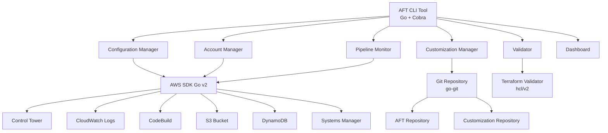

# 設計書

## 概要

AWS Control Tower Account Factory for Terraform (AFT) CLI ツールは、AFTの管理を効率化するためのコマンドラインインターフェースです。このツールは、AFTの設定確認、アカウント管理、パイプライン監視、カスタマイゼーション管理などの機能を提供し、クラウドエンジニアがAFTを簡単に操作できるようにします。

## アーキテクチャ

### 技術スタック
- **言語**: Go
- **AWS SDK**: AWS SDK for Go v2
- **CLI フレームワーク**: Cobra CLI
- **設定管理**: Viper
- **ログ**: uber-go/zap
- **テスト**: Go標準テストパッケージ + testify

### 全体アーキテクチャ



### レイヤー構造

1. **CLI Layer**: ユーザーインターフェース層
2. **Service Layer**: ビジネスロジック層
3. **Integration Layer**: 外部サービス統合層
4. **Data Layer**: データアクセス層

## コンポーネントと インターフェース

### 1. CLI コマンドインターフェース

#### 主要コマンド
- `aft config show` - AFT設定表示
- `aft account list` - アカウント一覧
- `aft account create` - アカウント作成
- `aft account update` - アカウント更新
- `aft pipeline status` - パイプライン状況
- `aft pipeline logs` - パイプラインログ
- `aft validate` - 設定検証
- `aft dashboard` - ダッシュボード表示
- `aft customization manage` - カスタマイゼーション管理
- `aft setup` - 初期設定
- `aft version` - バージョン情報表示

#### コマンド構造
```
aft <command> <subcommand> [options] [arguments]
```

### 2. Configuration Manager

AFTの設定情報を管理するコンポーネント

```go
type AFTConfig struct {
    AFTManagementAccountID                    string            `yaml:"aft_management_account_id"`
    AFTExecutionRoleName                     string            `yaml:"aft_execution_role_name"`
    CTHomeRegion                             string            `yaml:"ct_home_region"`
    TFBackendRegion                          string            `yaml:"tf_backend_region"`
    RepositoryConfig                         RepositoryConfig  `yaml:"repository_config"`
    VCSProvider                              string            `yaml:"vcs_provider"` // github, codecommit, gitlab
}

type RepositoryConfig struct {
    AccountRequestRepo                       string `yaml:"account_request_repo"`
    GlobalCustomizationsRepo                 string `yaml:"global_customizations_repo"`
    AccountCustomizationsRepo                string `yaml:"account_customizations_repo"`
    AccountProvisioningCustomizationsRepo    string `yaml:"account_provisioning_customizations_repo"`
}

type ConfigManager interface {
    LoadConfig() (*AFTConfig, error)
    ValidateConfig(config *AFTConfig) *ValidationResult
    ShowConfig() error
    TestConnectivity() (*ConnectivityResult, error)
}
```

### 3. Account Manager

AFTアカウントの管理を行うコンポーネント

```go
type AccountStatus string

const (
    AccountStatusProvisioning AccountStatus = "PROVISIONING"
    AccountStatusActive       AccountStatus = "ACTIVE"
    AccountStatusFailed       AccountStatus = "FAILED"
    AccountStatusSuspended    AccountStatus = "SUSPENDED"
)

type AccountInfo struct {
    AccountID          string        `json:"account_id"`
    AccountName        string        `json:"account_name"`
    AccountEmail       string        `json:"account_email"`
    OrganizationalUnit string        `json:"organizational_unit"`
    Status             AccountStatus `json:"status"`
    ProvisioningDate   time.Time     `json:"provisioning_date"`
    LastModified       time.Time     `json:"last_modified"`
    Customizations     []string      `json:"customizations"`
}

type AccountManager interface {
    ListAccounts(filters *AccountFilter) ([]*AccountInfo, error)
    CreateAccount(request *AccountRequest) (string, error)
    UpdateAccount(accountID string, updates *AccountUpdate) error
    GetAccountStatus(accountID string) (*AccountStatus, error)
    DeleteAccount(accountID string) error
}
```

### 4. Pipeline Monitor

AFTパイプラインの監視を行うコンポーネント

```go
type PipelineStatusType string

const (
    PipelineStatusRunning   PipelineStatusType = "RUNNING"
    PipelineStatusSucceeded PipelineStatusType = "SUCCEEDED"
    PipelineStatusFailed    PipelineStatusType = "FAILED"
    PipelineStatusStopped   PipelineStatusType = "STOPPED"
)

type PipelineStatus struct {
    PipelineName string             `json:"pipeline_name"`
    Status       PipelineStatusType `json:"status"`
    StartTime    time.Time          `json:"start_time"`
    EndTime      *time.Time         `json:"end_time,omitempty"`
    Duration     *time.Duration     `json:"duration,omitempty"`
    Stages       []PipelineStage    `json:"stages"`
}

type PipelineMonitor interface {
    GetPipelineStatus() ([]*PipelineStatus, error)
    GetPipelineLogs(pipelineName string, stage *string) (string, error)
    WatchPipeline(pipelineName string) (<-chan PipelineEvent, error)
    RetryFailedPipeline(pipelineName string) error
}
```

### 5. Customization Manager

AFTカスタマイゼーションの管理を行うコンポーネント

```typescript
interface CustomizationInfo {
  type: 'global' | 'account' | 'provisioning';
  name: string;
  description: string;
  targetAccounts: string[];
  lastDeployed: Date;
  status: 'ACTIVE' | 'PENDING' | 'FAILED';
}

interface CustomizationManager {
  listCustomizations(): Promise<CustomizationInfo[]>;
  deployCustomization(customization: CustomizationRequest): Promise<void>;
  updateCustomization(name: string, updates: CustomizationUpdate): Promise<void>;
  rollbackCustomization(name: string, version: string): Promise<void>;
  getCustomizationStatus(name: string): Promise<CustomizationStatus>;
}
```

### 6. Validator

AFT設定とTerraformコードの検証を行うコンポーネント

```typescript
interface ValidationResult {
  isValid: boolean;
  errors: ValidationError[];
  warnings: ValidationWarning[];
  suggestions: string[];
}

interface Validator {
  validateAFTConfig(config: AFTConfig): ValidationResult;
  validateTerraformCode(path: string): ValidationResult;
  validateAccountRequest(request: AccountRequest): ValidationResult;
  validateCustomization(customization: CustomizationRequest): ValidationResult;
}
```

### 7. Dashboard

AFT管理状況の可視化を行うコンポーネント

```typescript
interface DashboardData {
  summary: {
    totalAccounts: number;
    activeAccounts: number;
    failedAccounts: number;
    provisioningAccounts: number;
  };
  metrics: {
    successRate: number;
    averageProvisioningTime: number;
    recentActivities: Activity[];
  };
  health: {
    aftInfrastructure: HealthStatus;
    pipelines: HealthStatus;
    repositories: HealthStatus;
  };
}

interface Dashboard {
  getDashboardData(): Promise<DashboardData>;
  generateReport(format: 'json' | 'html' | 'csv'): Promise<string>;
  exportMetrics(timeRange: TimeRange): Promise<MetricsData>;
}
```

## データモデル

### Account Request Model
```go
type AccountRequest struct {
    AccountName        string            `json:"account_name" yaml:"account_name"`
    AccountEmail       string            `json:"account_email" yaml:"account_email"`
    OrganizationalUnit string            `json:"organizational_unit" yaml:"organizational_unit"`
    AccountTags        map[string]string `json:"account_tags,omitempty" yaml:"account_tags,omitempty"`
    Customizations     []string          `json:"customizations,omitempty" yaml:"customizations,omitempty"`
    SSOUserEmail       string            `json:"sso_user_email,omitempty" yaml:"sso_user_email,omitempty"`
    SSOUserFirstName   string            `json:"sso_user_first_name,omitempty" yaml:"sso_user_first_name,omitempty"`
    SSOUserLastName    string            `json:"sso_user_last_name,omitempty" yaml:"sso_user_last_name,omitempty"`
}
```

### Configuration Model
```go
type OutputFormat string

const (
    OutputFormatJSON  OutputFormat = "json"
    OutputFormatTable OutputFormat = "table"
    OutputFormatYAML  OutputFormat = "yaml"
)

type Verbosity string

const (
    VerbosityQuiet   Verbosity = "quiet"
    VerbosityNormal  Verbosity = "normal"
    VerbosityVerbose Verbosity = "verbose"
)

type CLIConfig struct {
    Profile      string       `yaml:"profile"`
    Region       string       `yaml:"region"`
    AFTConfig    *AFTConfig   `yaml:"aft_config"`
    OutputFormat OutputFormat `yaml:"output_format"`
    Verbosity    Verbosity    `yaml:"verbosity"`
}
```

## エラーハンドリング

### エラー分類
1. **Configuration Errors**: 設定関連のエラー
2. **Authentication Errors**: 認証関連のエラー
3. **Validation Errors**: 検証関連のエラー
4. **Network Errors**: ネットワーク関連のエラー
5. **Service Errors**: AWSサービス関連のエラー

### エラーハンドリング戦略
- 明確なエラーメッセージの提供
- 修復手順の提示
- ログ出力による詳細情報の記録
- 適切な終了コードの設定

```go
type AFTError struct {
    Message     string   `json:"message"`
    Code        string   `json:"code"`
    Suggestions []string `json:"suggestions,omitempty"`
}

func (e *AFTError) Error() string {
    return e.Message
}

func NewAFTError(message, code string, suggestions ...string) *AFTError {
    return &AFTError{
        Message:     message,
        Code:        code,
        Suggestions: suggestions,
    }
}
```

## テスト戦略

### テストレベル
1. **Unit Tests**: 各コンポーネントの単体テスト
2. **Integration Tests**: AWS サービスとの統合テスト
3. **E2E Tests**: エンドツーエンドのシナリオテスト
4. **Performance Tests**: パフォーマンステスト

### テスト環境
- モックAWSサービスを使用した単体テスト
- 専用のAFT環境での統合テスト
- CI/CDパイプラインでの自動テスト実行

### テストデータ管理
- テスト用のAFT設定ファイル
- モックアカウントデータ
- テスト用カスタマイゼーション

## セキュリティ考慮事項

### 認証・認可
- AWS IAMロールベースの認証
- 最小権限の原則に基づく権限設定
- MFA対応

### データ保護
- 設定ファイルの暗号化
- 機密情報のマスキング
- ログの適切な管理

### 監査
- 操作ログの記録
- CloudTrailとの連携
- コンプライアンス要件への対応

## パフォーマンス要件

### レスポンス時間
- 設定表示: < 2秒
- アカウント一覧: < 5秒
- パイプライン状況: < 3秒
- 検証処理: < 10秒

### スケーラビリティ
- 1000アカウント以上の管理対応
- 並行処理による高速化
- キャッシュ機能による応答性向上

## 運用考慮事項

### ログ管理
- 構造化ログの出力
- ログレベルの設定可能
- ログローテーション対応

### 監視
- ヘルスチェック機能
- メトリクス収集
- アラート機能

### 更新・メンテナンス
- 自動更新機能
- バージョン管理
- 後方互換性の維持